# YBAVIT deck: section screenshots and redesign prompts

Screenshots are in this folder (1440 × 900, Client view).

## 01 Cover

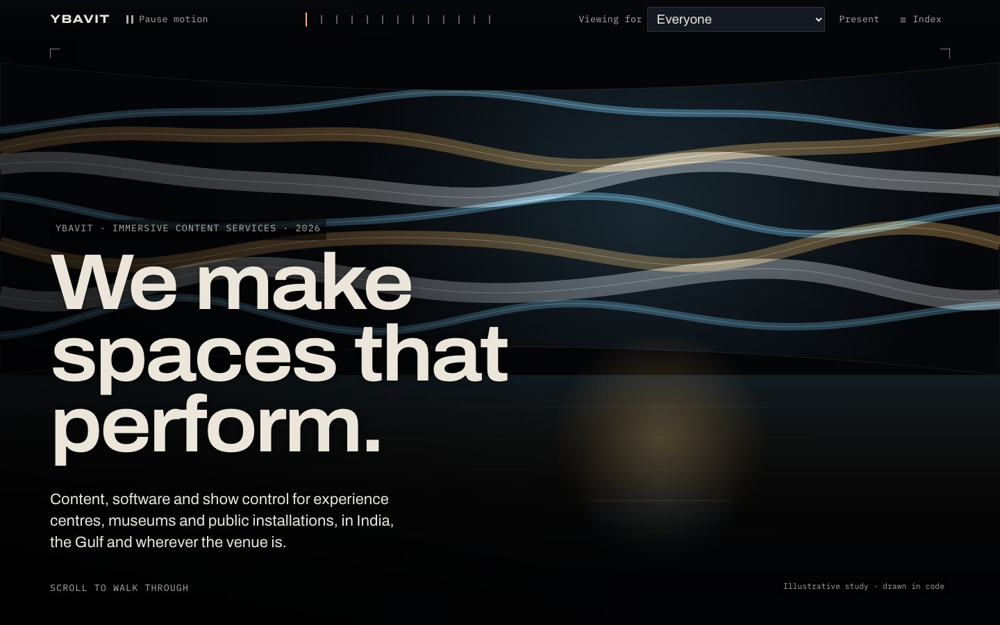

Full-screen dark website hero for an immersive content studio called YBAVIT: a curved LED wall of flowing amber, blue and white light ribbons glows over a reflective floor. Lower left sits a small mono eyebrow, a huge bone-white headline "We make spaces that perform.", a short subhead and a "Scroll to walk through" cue. A thin top bar holds the wordmark, Pause motion, a row of chapter ticks, a "Viewing for" dropdown, Present and Index.

## 02 01 Promise

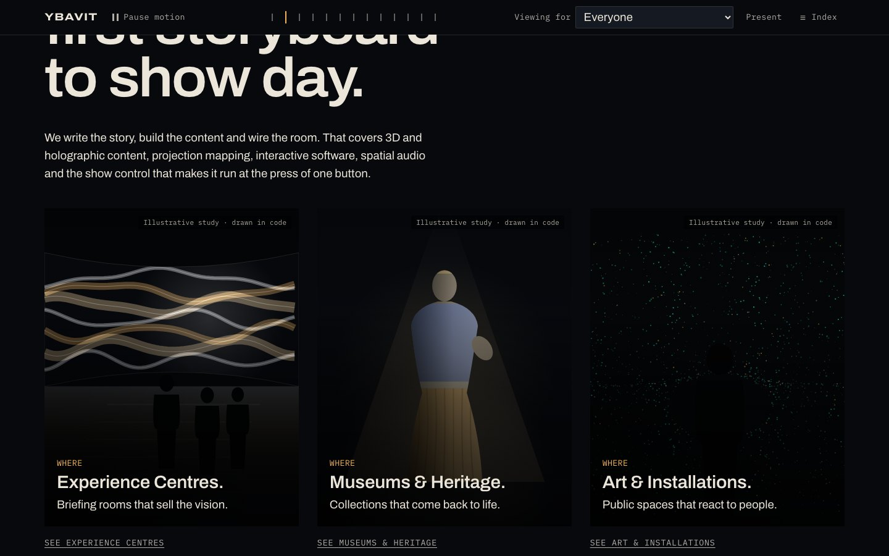

Dark website section ending a large headline "Ten disciplines, one team, from first storyboard to show day." with a short paragraph, above three tall 4:5 cards side by side. Each card shows a moody venue scene (a light-ribbon wall with silhouettes, a spotlit statue, a dark room of tiny teal particles) with a small amber label, a title (Experience Centres / Museums & Heritage / Art & Installations) and one line, with a "See chapter" link under each.

## 03 02 Why now: film band

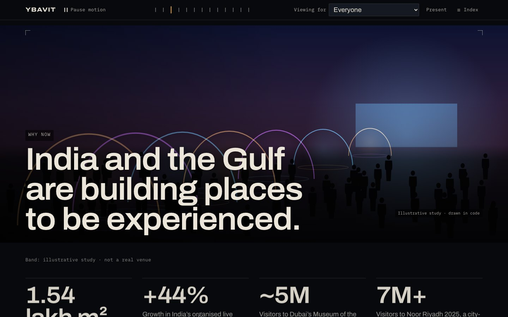

Wide cinematic 21:9 banner of a dusk outdoor light festival: glowing coloured arches, crowds in silhouette and a lit facade in the distance. Over its lower left sit a mono eyebrow "Why now" and the large headline "India and the Gulf are building places to be experienced.", with the top of four big statistics just below the banner.

## 04 02 Why now: figures and beliefs

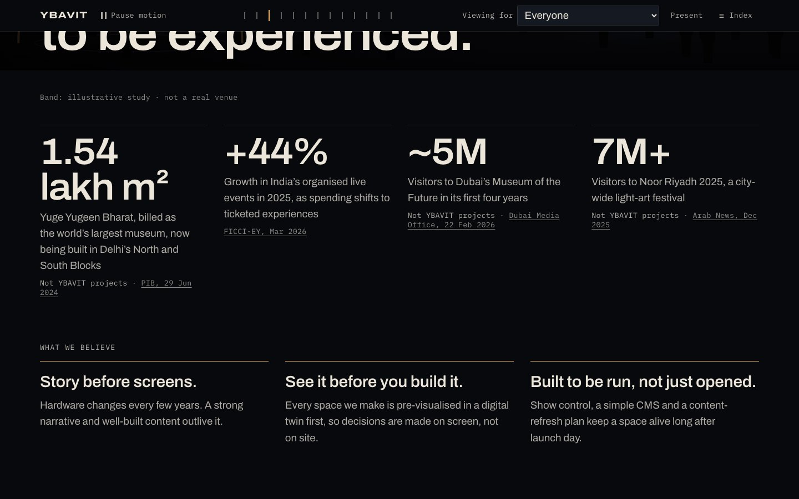

Dark section with four market figures in a row (1.54 lakh m², +44%, ~5M, 7M+), each with a one-line label and a small mono source link marked "Not YBAVIT projects". Below, under "What we believe", three text columns with amber top rules: Story before screens, See it before you build it, Built to be run, not just opened.

## 05 03 Offer map

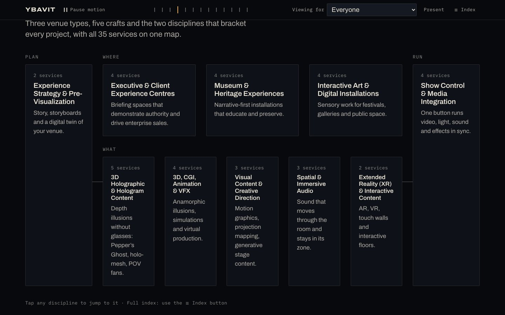

One-screen service map on a dark background: a tall PLAN card on the left, a tall RUN card on the right, and between them a WHERE row of three cards above a WHAT row of five narrow cards, joined by thin hairline arrows. Each card shows a small service count, a bold discipline name and a one-line description.

## 06 04 Experience Centres: opener

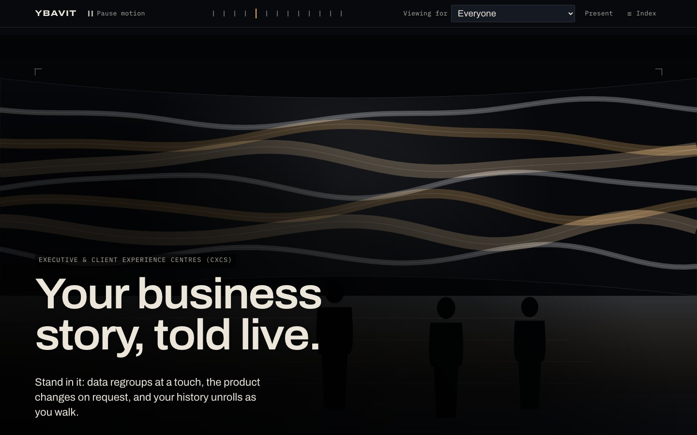

Full-screen chapter opener: a dark executive briefing room with a floor-to-ceiling wraparound LED wall of white and amber light ribbons and three standing silhouettes. Lower left: mono eyebrow "Executive & Client Experience Centres (CXCs)", the large headline "Your business story, told live." and a two-line subhead.

## 07 04 Experience Centres: service step

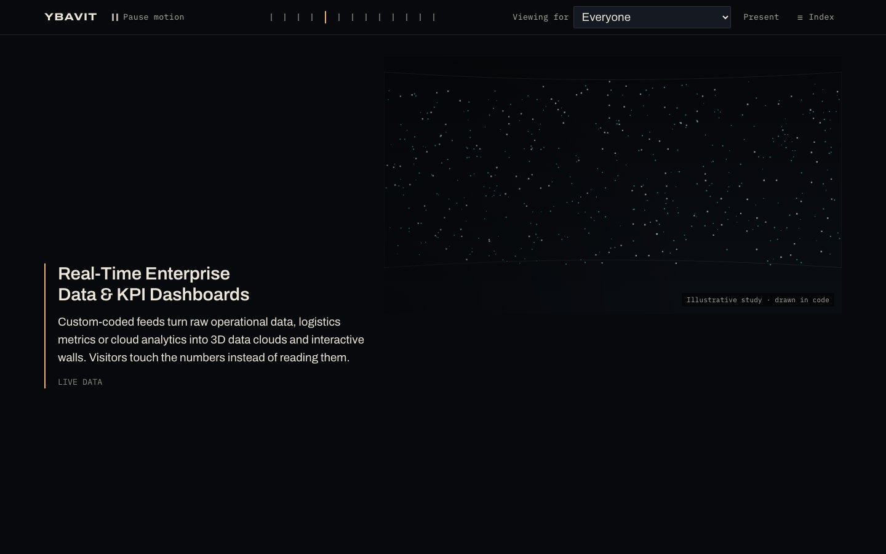

Scrollytelling step: on the left a text block with an amber left rule, the title "Real-Time Enterprise Data & KPI Dashboards", a paragraph and a mono "LIVE DATA" tag. On the right a sticky 16:9 frame shows a teal-and-white point cloud on a curved dark wall, with a small label bottom-right.

## 08 04 Experience Centres: outcome

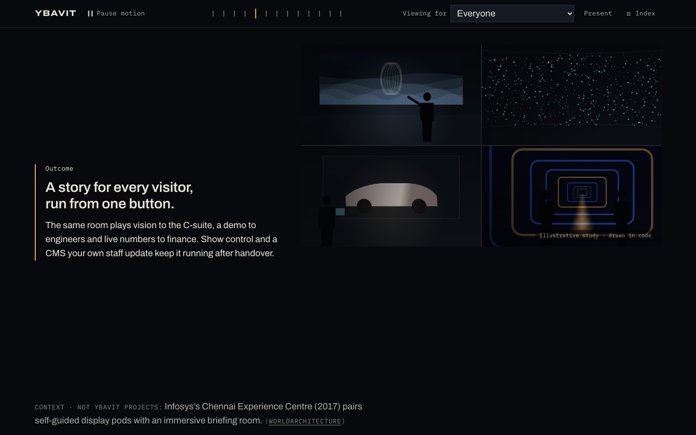

Outcome step: a left text block "A story for every visitor, run from one button." with a paragraph. On the right a 2×2 mosaic of the four earlier scenes (a presenter at an LED stage, a point cloud, a car on a display, an LED tunnel); a small mono context line with a source sits underneath.

## 09 05 Museums & Heritage: opener

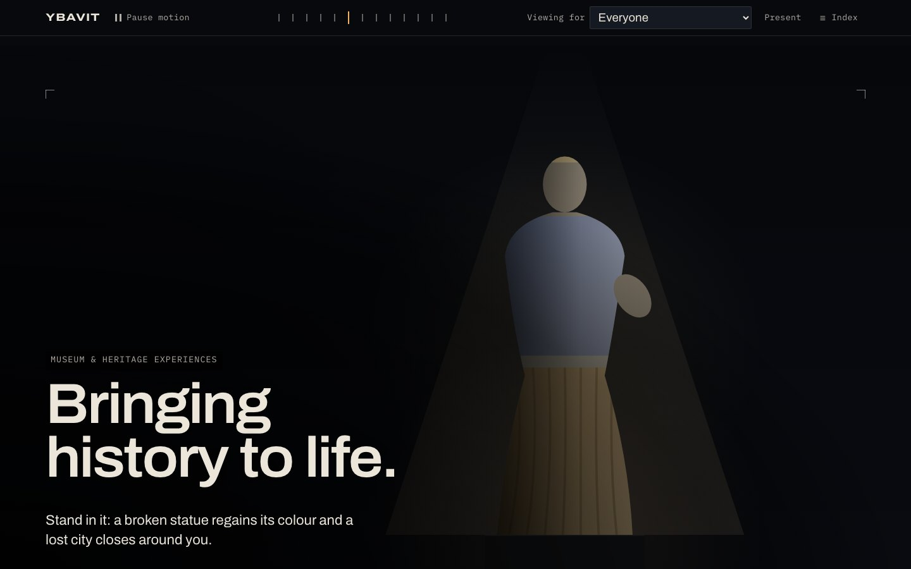

Full-screen museum chapter opener: a night gallery with one spotlight on a draped stone statue whose garment glows lapis blue and ochre, set right of centre. Lower left: mono eyebrow "Museum & Heritage Experiences", the large headline "Bringing history to life." and a subhead.

## 10 05 Museums & Heritage: service step

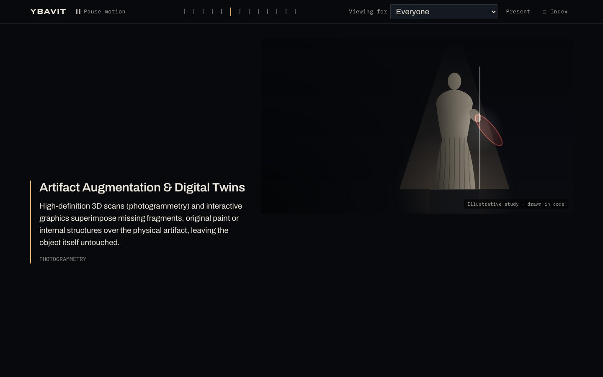

Scrollytelling step: left text with an amber rule, title "Artifact Augmentation & Digital Twins", a paragraph and a "PHOTOGRAMMETRY" tag. On the right a sticky 16:9 frame of a spotlit stone statue with a white scan line sweeping across it and a red outline restoring its missing arm.

## 11 06 Art & Installations: opener

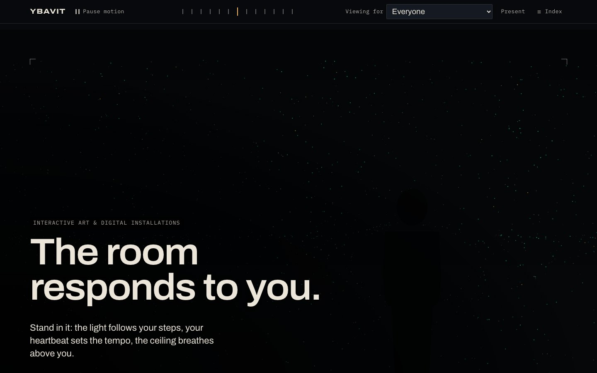

Full-screen opener for interactive art: an almost black room filled with a faint teal-and-amber particle field and one dark silhouette walking through it. Lower left: mono eyebrow "Interactive Art & Digital Installations", the large headline "The room responds to you." and a subhead.

## 12 06 Art & Installations: service step

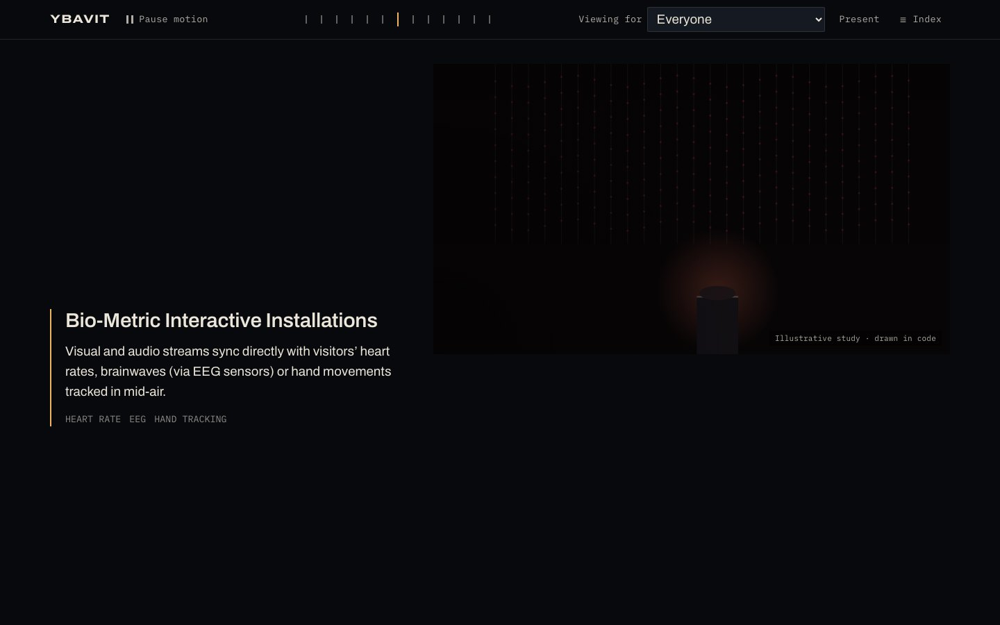

Scrollytelling step: left text with an amber rule, title "Bio-Metric Interactive Installations", a paragraph and tags "HEART RATE · EEG · HAND TRACKING". On the right a sticky 16:9 dark frame where hanging strands of red LED points pulse around a glowing sensor pedestal.

## 13 07 Craft explorer: matrix

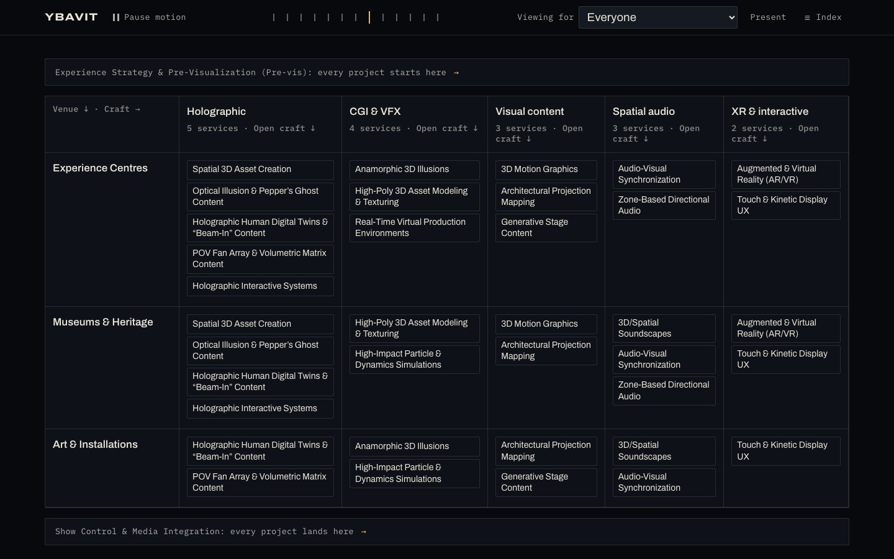

Dark data table under the end of a headline "every venue." and the subhead "Five crafts, seventeen services." Rows are three venues (Experience Centres, Museums & Heritage, Art & Installations), columns are five crafts (Holographic, CGI & VFX, Visual content, Spatial audio, XR & interactive), and each cell lists the service names as small outlined links. Thin banner rows above and below point to Pre-vis and Show Control.

## 14 07a Holographic panel

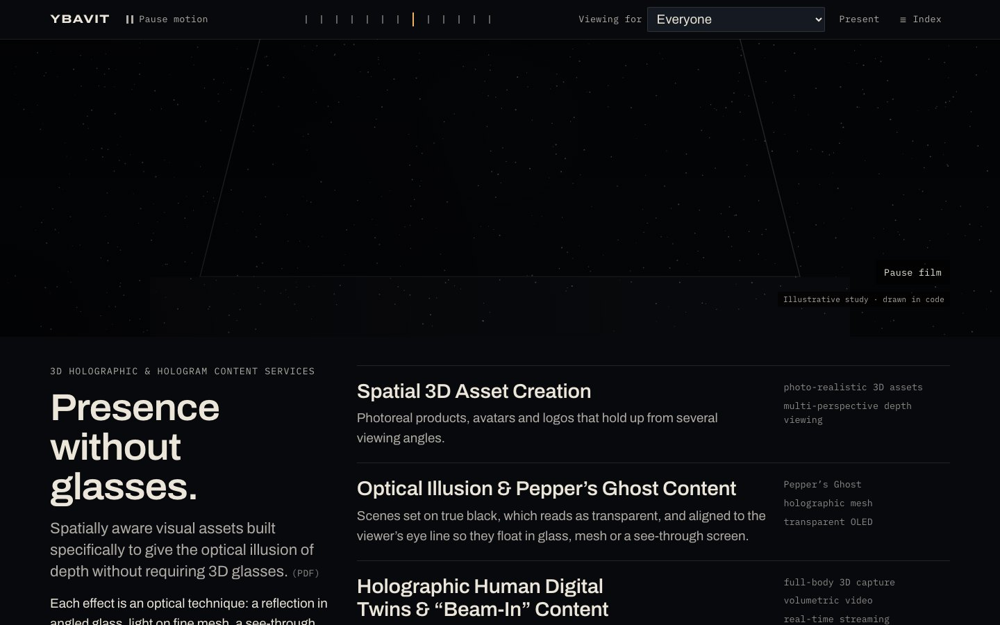

Craft panel: a wide film band on top shows an empty dark stage behind a faint angled glass pane, with a "Pause film" button. Below, the left column holds a mono eyebrow, the large headline "Presence without glasses.", a grey subhead and body; the right column is a ruled list of services with bold names, descriptions and mono technique tags.

## 15 07b CGI & VFX panel

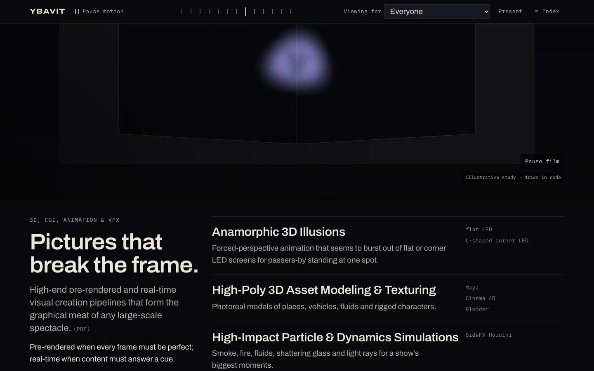

Craft panel: a wide film band of a dark L-shaped corner LED screen on a building with a blurred blue-violet form bursting from the corner, plus a "Pause film" button. Below, the headline "Pictures that break the frame." with a grey subhead on the left and a ruled services list (Anamorphic 3D Illusions, High-Poly 3D Asset Modeling & Texturing, High-Impact Particle & Dynamics Simulations) with tool tags (Maya, Cinema 4D, Blender) on the right.

## 16 08 Pre-vis: storyboard

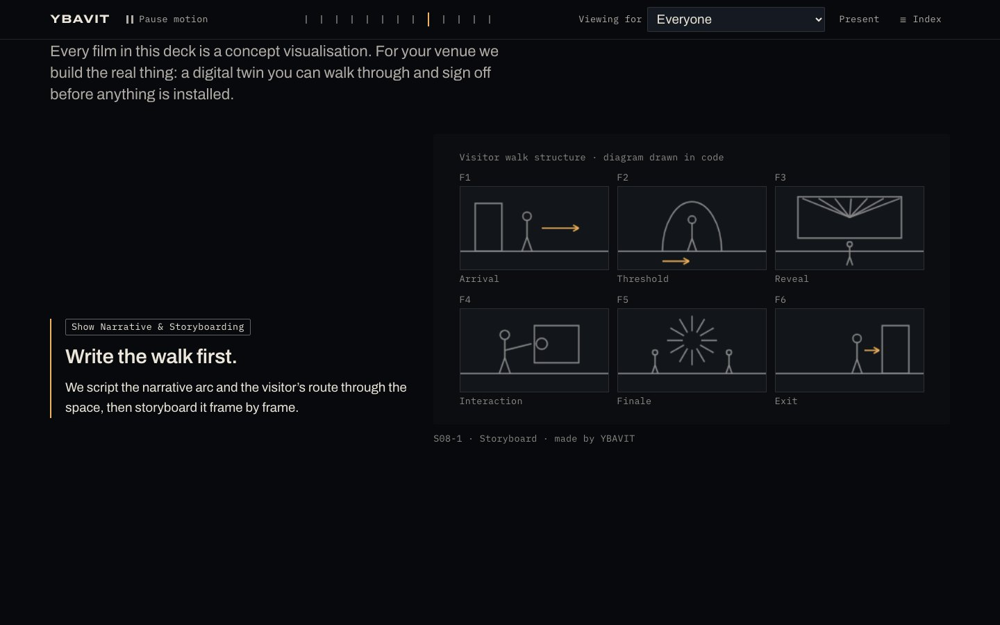

Pre-vis chapter step: on the left a chip "Show Narrative & Storyboarding", the title "Write the walk first." and a short paragraph with an amber left rule. On the right a frame holding a 3×2 grid of simple grey line-drawn storyboard panels (Arrival, Threshold, Reveal, Interaction, Finale, Exit) with amber movement arrows and a mono caption.

## 17 08 Pre-vis: sightlines

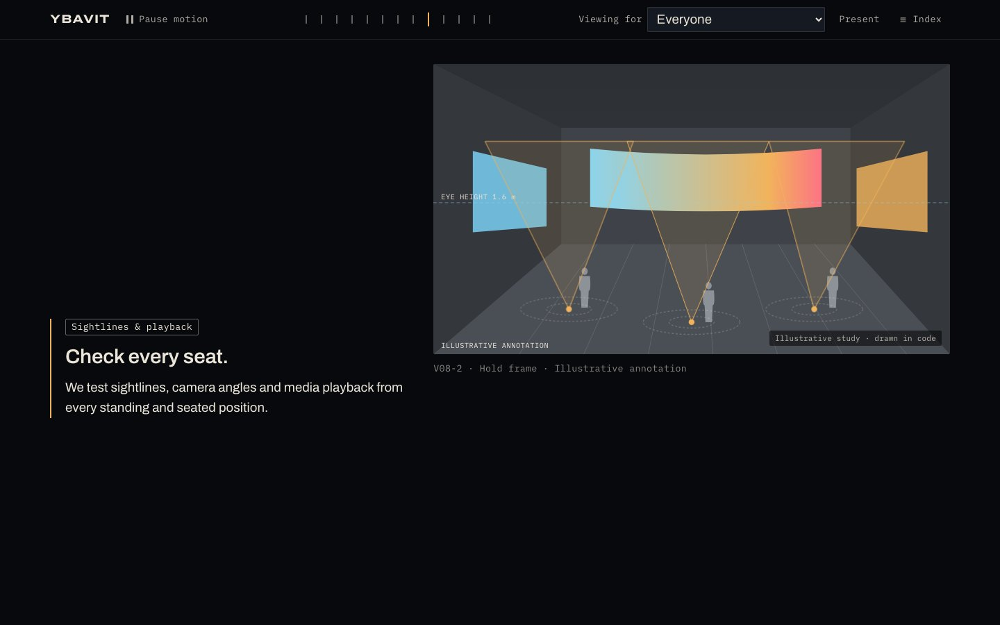

Step "Check every seat." with the chip "Sightlines & playback" on the left. On the right a grey-box 3D hall with a curved gradient LED wall and two side screens, three grey mannequins, translucent amber sightline cones, dashed distance rings and an "EYE HEIGHT 1.6 m" line, captioned "Illustrative annotation".

## 18 08 Pre-vis: sign-off

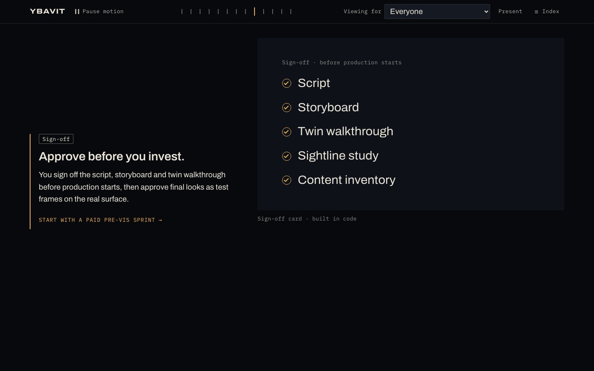

Step "Approve before you invest." with the chip "Sign-off", a paragraph and an amber link "Start with a paid pre-vis sprint →". On the right a dark card titled "Sign-off · before production starts" lists five items with amber check circles: Script, Storyboard, Twin walkthrough, Sightline study, Content inventory.

## 19 09 Show control: cue timeline

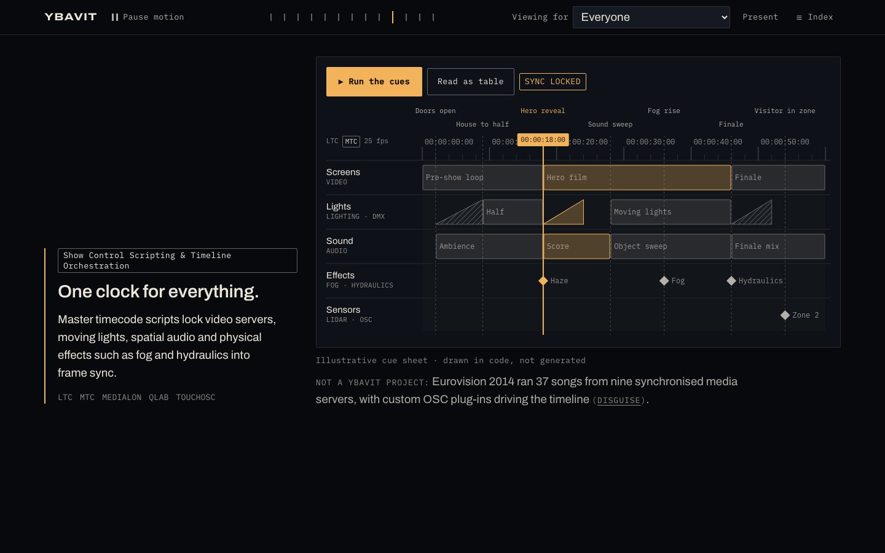

Show-control step: left text "One clock for everything." with the chip "Show Control Scripting & Timeline Orchestration" and tags (LTC, MTC, MEDIALON, QLAB, TOUCHOSC). On the right a dark cue-timeline panel with an amber "Run the cues" button, "Read as table", a "SYNC LOCKED" chip, a timecode ruler, named cue markers (Doors open, Hero reveal, Finale) and five lanes (Screens, Lights, Sound, Effects, Sensors) of grey blocks, hatched fades and diamonds, crossed by an amber playhead.

## 20 09 Show control: warp

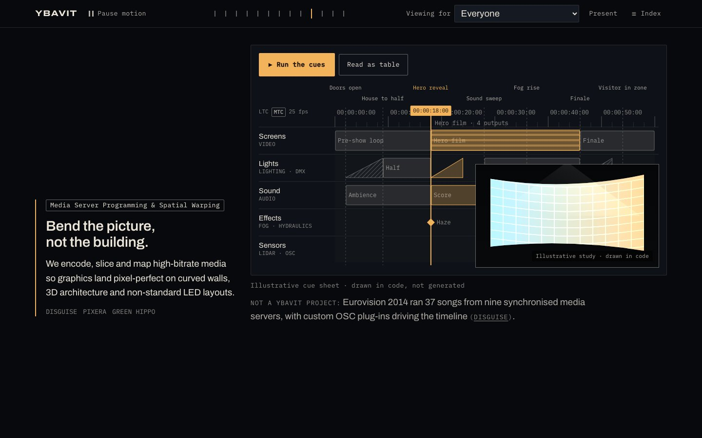

The same cue timeline on the step "Bend the picture, not the building.": the video lane is split into four amber output slices, and an inset in the lower right shows a projected calibration grid bending onto a curved white wall.

## 21 09 Show control: venue day

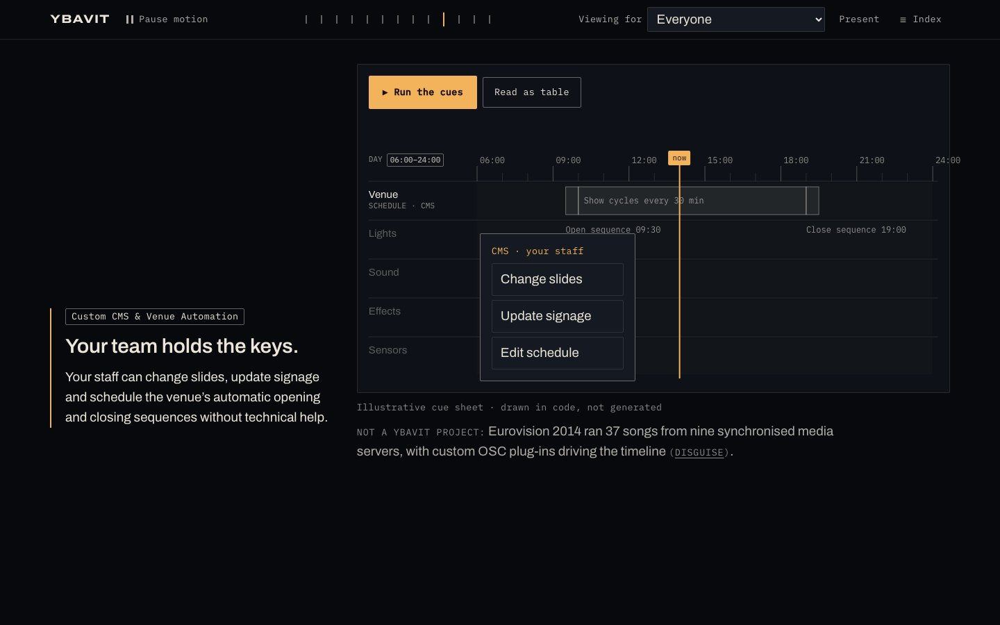

The timeline rescaled to a full day (06:00–24:00): one "Venue" lane with "Open sequence 09:30", a long "Show cycles every 30 min" block and "Close sequence 19:00", an amber "now" marker, and a small CMS card with the buttons Change slides, Update signage, Edit schedule. Left text: "Your team holds the keys."

## 22 10 How we work together

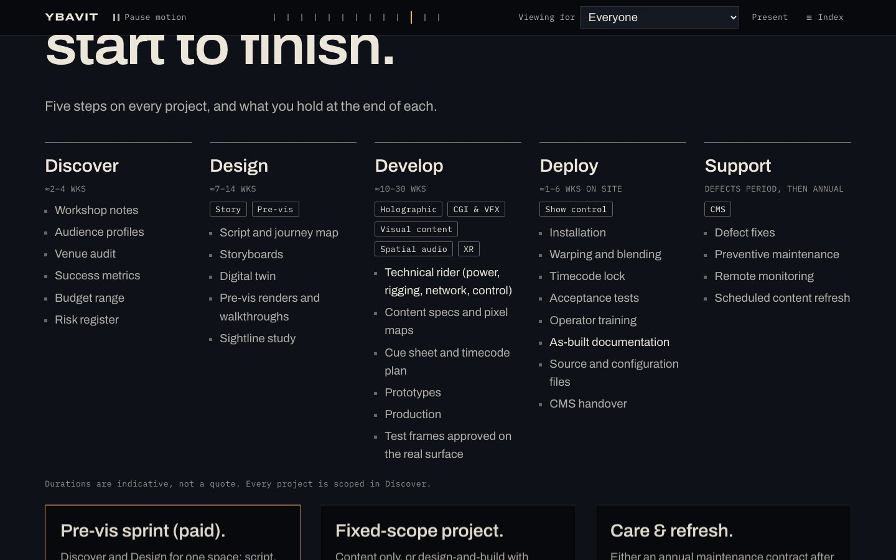

Process section on a slightly lighter dark background: the end of the headline "start to finish." and a five-column phase strip (Discover, Design, Develop, Deploy, Support), each with a mono duration, small discipline chips (Story, Pre-vis, Holographic, Show control) and a bullet list of deliverables. The top of three engagement cards begins below, the first outlined in amber.

## 23 11 Proof & people

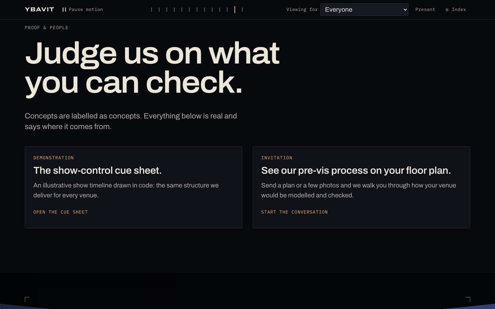

Proof section: the large headline "Judge us on what you can check." and a grey subhead, then two outlined cards side by side, "Demonstration · The show-control cue sheet." and "Invitation · See our pre-vis process on your floor plan.", each with a paragraph and an amber uppercase link.

## 24 12 Next step

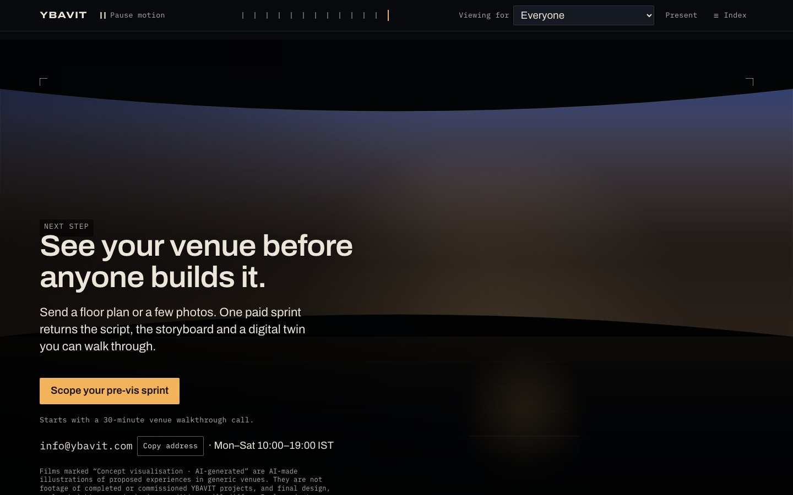

Closing full-screen section: a dim dusk-blue curved LED wall over a dark floor. Lower left: eyebrow "Next step", the headline "See your venue before anyone builds it.", a subhead, an amber "Scope your pre-vis sprint" button, the email info@ybavit.com with a "Copy address" button, office hours, and a small mono disclosure about AI concept films.
